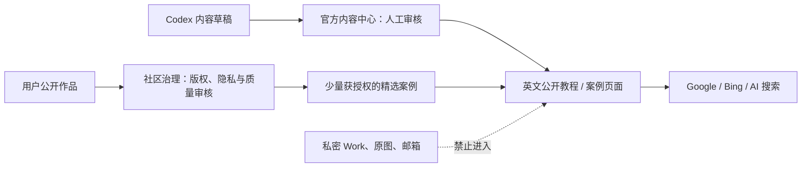

# M2.1 内容中心、社区治理与 SEO/GEO 讨论基线

> 状态：讨论结论已确认；第 11 节决策已于 2026-08-25 确认，社区后台“完整社区域读取、隐藏项仅标记”的边界已于 2026-08-26 确认，并已据此形成 M2.1/M2.2 待审阅正式 Spec 与 API 草案。本文仍不能替代实现验收。
>
> 目的：汇总截至 2026-08-25 已讨论的内容中心、社区治理、SEO/GEO、Codex/MCP、站外分享和视频嵌入方向；把已确认事实、推荐方案和待确认决策明确分开。正式规格见第 12 节链接。

## 1. 结论与范围

PixoMosaic 不应把“官方教程/博客”和“用户社区作品”混为同一种内容：二者的作者、权限、隐私、质量控制和搜索收录规则完全不同。

推荐把后续工作拆为三个相互协作、但数据与权限隔离的模块：

| 模块 | 目标 | 内容来源 | 默认能否被搜索收录 |
| --- | --- | --- | --- |
| M2 社区/灵感库 | 用户发布、浏览、互动与举报 | 已验证注册用户 | 否；运营设为精选后自动收录 |
| M2.1 官方内容中心 | 工具使用指引、创意内容、产品教程、FAQ、案例文章和品牌更新 | 仅 Staff/Admin；Codex 仅协助草稿 | 是；承担 SEO/GEO 主力 |
| M2.2 社区治理后台 | 精选、下架、举报处理、用户运营档案 | Staff/Admin | 不适用；它是内部管理功能 |

本讨论还增加两项公开内容能力：

1. 允许访客将**公开文章或任何仍公开的社区帖子**分享至主流平台；
2. 允许官方文章受控嵌入 YouTube、TikTok 等外部视频，并在网站内观看。

不在本轮讨论范围：AI 自动公开发布、自动向 TikTok/YouTube 发帖、向文章系统开放普通用户投稿、读取用户私密 Work/原图、评论/私信、付费或社交平台账号接入。

## 2. 当前事实：已有能力与缺口

### 2.1 已存在的 M2 基础

当前分支已经有本地 M2 社区数据与用户侧 API：用户可从自己的 active Work 发布社区帖、公开浏览、点赞、收藏、举报及自行撤回。社区公开响应已经与私有 `Work`、`WorkDocument`、`WorkAsset` 隔离。

但现有功能不是可运营的内容后台：

- Payload `/admin` 未注册社区原始数据表，无法查看帖子队列、举报队列或某用户完整发帖历史；
- 目前没有运营人员的精选、下架、删除、封禁和举报处理 API；
- 用户备注、特别关注、作者关注和治理操作审计链尚未实现；
- 前端没有博客/教程入口、文章详情页或文章管理后台；
- 前端只有站点级英文标题与描述，尚无 `sitemap.xml`、`robots.txt`、每页 canonical、Open Graph 或结构化数据。

因此，本文件中的能力均不得表述为“已经上线”。

### 2.2 已有安全边界必须保留

- 私密 Work、图纸 JSON、原图、邮箱、内部数字 ID、对象存储键和私有下载地址不进入公开文章、分享页、搜索索引或运营展示页。
- 社区公开媒体与文章媒体必须使用各自独立的受控存储命名空间；文章不得复用用户私密图纸资产。
- 任何管理或 MCP 写操作继续使用服务端鉴权、角色校验、审计、事务与幂等；不能信任前端传入的角色、状态或作者标识。
- 前端仓库与后端仓库保持独立；接口变更必须另写版本化契约并联调，不能通过共享文件或数据库直改耦合。

## 3. 内容、社区与私密数据的关系



### 3.1 官方文章与社区帖子不能合并

| 维度 | 官方文章/教程 | 社区帖子 |
| --- | --- | --- |
| 作者 | Staff/Admin，或由其审核的 Codex 草稿 | 已验证用户 |
| 内容 | 受控 Markdown/富文本、FAQ、图文和视频块 | 标题、分类、标签、封面、过程图和冻结图纸版本 |
| 收录策略 | 已发布且审核通过时可收录 | 默认不收录；运营设为精选后自动收录 |
| 变更 | 有草稿、审核、排期、发布、更新和归档流程 | 作者可改允许字段或撤回；运营可按治理流程下架 |
| 数据安全 | 仅引用公开安全投影 | 不暴露私密 Work、原图或用户资料；社交链接可逐条公开/隐藏 |

公开内容同时保留两个不重叠的入口：

- `/guides/[slug]`：网站工具的使用教程、操作指引、照片转图纸、尺寸/颗数选择、导出与制作流程；
- `/blog/[slug]`：创意灵感、产品教程、主题案例、品牌内容与活动更新。

两类内容使用同一套文章模型、审核流和 SEO 基础，但每篇文章必须明确 `contentType` 与所属入口；同一主题不得在两个入口以近似正文重复发布。

## 4. M2.1 官方内容中心（推荐方案）

### 4.1 内容后台与发布流程

复用现有 Payload `/admin` 的认证与角色体系，但新增独立的 `Articles` 与 `ArticleMedia` 内容集合，不把文章混进社区原始表或用户作品表。

建议生命周期：

```text
idea → draft → in_review → scheduled → published → needs_update → archived
```

- Codex 生成的文章先以 `draft` 进入后台可见的内容队列；`Staff/Admin` 可以创建、编辑、审核、排期或发布文章，普通用户不开放文章发布。
- 公开页面只读取 `published` 内容；草稿、待审核、排期前和归档内容不加入站点地图。
- 发布、撤回、修改已发布正文、改 SEO 元数据等高影响操作必须记录操作者、时间、原因和变更前后状态。
- 正文采用受控 Markdown 或 Payload 富文本；禁止直接保存和渲染任意 HTML、iframe 或脚本。

### 4.2 建议字段（讨论稿，尚未冻结）

| 分组 | 字段 |
| --- | --- |
| 基础信息 | 标题、slug、摘要、内容类型（guide / faq / case-study / announcement）、分类、标签 |
| 正文与媒体 | 受控正文、封面、封面英文 alt 文本、内容专用图片、受控视频块 |
| SEO | SEO 标题、描述、canonical、Open Graph 图、`indexable`、相关内链 |
| 责任与状态 | 作者、审核人、状态、排期时间、首次发布时间、最近更新时间、下次复审时间 |
| 质量依据 | 选题意图、来源/引用清单、原始示例来源、内部编辑备注 |
| 案例关联 | 仅可选关联已公开、额外授权且运营审批通过的社区安全投影 |

文章图片和视频封面必须属于内容媒体；不能因为用户作品已经“公开”就默认把其照片放入官方博客或社交分享图。

## 5. SEO/GEO 基础架构

### 5.1 首发应完成的技术面

- 首页、教程列表、教程详情、政策页面和获准收录的精选案例使用英文服务端渲染或预渲染，不能只依赖浏览器加载。
- 每个公开页具有独立的英文 `title`、description、canonical、Open Graph / Twitter 分享图和可读 URL。
- `sitemap.xml` 只列出已发布、`indexable=true` 的官方文章及仍公开的精选社区案例；草稿、后台、登录、个人图纸、上传页和非精选社区帖不列入。
- `robots.txt` 只说明爬虫可抓取的路径；它**不能代替 `noindex`**。需要保持私密的页面应要求登录，并返回 `noindex`；已下架的公开内容应从 sitemap 和公开导航移除，永久删除时是否返回 `410` 留待 Spec 决定。
- 使用真实且与可见内容一致的 `WebSite`、`SoftwareApplication`、`Article`、`BreadcrumbList`、可见 FAQ 以及在信息完整时使用 `VideoObject` 等结构化数据；不伪造评分、评论、排名或媒体信息。
- 图片使用清楚的英文 alt 文本、正确尺寸和压缩；用户私密照片永不进入 SEO 或分享图。
- 工具编辑器按需加载，保证营销正文和首屏信息优先呈现。

### 5.2 GEO 的实施原则

GEO 不是另一套排名插件。每篇文章应直接回答一个真实问题，并提供步骤、限制、例子、可验证来源、作者/审核人及更新时间；清楚说明 PixoMosaic 是什么、免费能力是什么、输出什么、适合谁、如何处理照片隐私。

`llms.txt` 可在公开内容稳定后作为站点说明文件评估引入，但不作为排名承诺，也不能替代正常 SEO、结构化内容或页面可抓取性。

### 5.3 数据与增长衡量

上线后再接入 Google Search Console、GA4、Bing Webmaster Tools；Cloudflare Web Analytics 可作辅助，但不混成同一数据口径。只记录必要的业务事件，例如：

- `upload_started`、`pattern_generated`、`guide_exported`；
- `sign_up_started`、`sign_up_completed`、`marketing_opt_in`；
- `content_share_clicked`（内容 ID、分享渠道，不含邮箱、照片、图片内容或用户标识）。

来自公开分享入口的链接可附带标准 UTM（如 `utm_source=pinterest`、`utm_medium=social`、`utm_campaign=organic_share`）；页面 canonical 必须仍指向不含 UTM 的原始 URL。

注册条款同意和营销订阅必须分开：营销订阅默认不勾选，独立保存同意时间、版本、来源与退订时间；事务邮件与营销邮件分离，营销邮件必须一键退订。

## 6. 公开内容分享按钮

### 6.1 目标与适用页面

分享不是“自动替用户发帖”。它的目标是让访客将当前公开 URL 分享到平台，并让接收方看到统一的标题、摘要和分享图。

第一版出现在：

- 已发布的官方教程/文章；
- 所有仍为 `published` 的社区帖子。

它不能出现在 `/admin`、登录、个人图纸册、上传流程、私密 Work、普通社区帖子或任何带用户私密参数的 URL。

### 6.2 推荐的按钮策略

| 能力 | 推荐做法 | 说明 |
| --- | --- | --- |
| 复制链接 | 始终提供 | 最稳定，桌面和手机都可用 |
| 系统分享 | 支持时调用浏览器 Web Share | 主要覆盖手机原生分享面板；失败时回退到复制链接 |
| 外部分享链接 | Facebook、X、Pinterest、Reddit、LinkedIn、WhatsApp、Telegram | 打开各平台的公开分享/撰文页面，仅传公开 URL 和编码后的标题/摘要 |
| Pinterest | 使用内容专用、可公开使用的竖版或横版分享图 | 不使用用户私密图片；图片必须与文章或案例一致 |
| TikTok / YouTube | 第一版仅复制链接或使用系统分享 | 普通网页没有可靠、统一的“把外链直接发布成 TikTok/YouTube 帖子”接口；不要把按钮标成“发布到 TikTok/YouTube” |

不做社交分享次数统计、第三方社交追踪脚本或以访问者身份调用社交平台 API。分享按钮只记录本网站的点击事件，不能确认用户最终是否在平台完成发布。

### 6.3 分享页前置条件

- 公开页面必须有稳定 canonical URL、正确的 Open Graph 标题、描述和图片；平台抓取分享预览时不依赖 JavaScript 登录态。
- 分享图属于文章媒体或社区公开媒体；不能用用户私密原图或私有对象 URL。
- 对任何含 `utm_*` 的入口，页面本身仍输出干净 canonical，防止同一篇文章被搜索引擎视为多个版本。

## 7. YouTube / TikTok 视频嵌入与站内观看

### 7.1 推荐范围

官方教程可以嵌入品牌自有或明确已获授权的 YouTube、TikTok 视频；普通用户社区帖子第一期不允许提交任意第三方嵌入链接。这样能避免侵权、隐私、恶意 iframe 和内容审核成本。

视频是文章的补充，不能替代正文：每个嵌入视频需要同页的文字摘要、步骤和适用限制，以便无法播放、搜索引擎和 AI 仍能理解内容。

### 7.2 受控视频块而非任意 iframe

文章正文只保存结构化视频字段，而不是可执行 HTML：

| 字段 | 作用 |
| --- | --- |
| `platform` | 仅允许 `youtube`、`tiktok`；后续可按审核再增 Vimeo 等 |
| `videoId` 或标准公开视频 URL | 服务端解析并校验平台、域名和 ID 格式 |
| 标题、说明、文字摘要 | 读者理解、无障碍和搜索语义 |
| 发布日期、时长、封面来源 | 信息完整且真实时才用于 `VideoObject` |
| 外部原链接 | 嵌入失败时的安全回退 |
| 授权/归属确认 | 证明可嵌入或为品牌自有内容 |

前端根据平台生成固定、受限的播放器，不保存或渲染编辑者提供的任意 iframe、脚本、追踪像素或 HTML。部署时再按平台白名单配置 CSP `frame-src`。

### 7.3 播放、隐私与故障处理

- 采用点击后再加载播放器；默认不自动播放。这样可减少首屏性能和未同意时的第三方请求。
- YouTube 优先使用隐私增强嵌入域名；TikTok 仍可能产生平台请求或 Cookie，应显示外部媒体提示与“站内播放/前往平台”的选择，具体同意机制按隐私政策确认。
- 视频被删除、限区、嵌入禁用或平台临时故障时，文章正文保持可读，播放器位置显示说明和官方外链；不得使整页报错。
- 不自动抓取或保存第三方视频、评论、用户资料或缩略图；若需要站内封面，必须确认媒体权利和存储边界。

### 7.4 与社交分发的区别

“文章内观看 TikTok/YouTube 视频”与“自动向 TikTok/YouTube 发视频”是两件不同的事：

- 本期讨论的是前者，且不需要连接社交账号或索取 OAuth 授权；
- 后者属于独立的社交内容分发项目，未来若做，需逐个平台确认官方发布 API、账号资质、审核限制、素材版权、失败重试与人工确认，不能由当前内容 MCP 顺带获得发布权。

## 8. Codex / MCP / API 的阶段性边界

### 8.1 首发期：人工审核的草稿流

Codex 根据选题生成英文草稿、标题、FAQ、内链建议、视频脚本建议和来源清单；人工审核后再通过 Markdown 或后台内容中心发布。此阶段不要求 MCP、外部账号或自动发布。

### 8.2 当前 MCP：受限草稿能力与未来扩展点

当前 MCP/API 只提供最小草稿能力，可允许：

- 读取内容规范、选题池、已发布文章和无敏感的站内内链目录；
- 创建/更新 `draft` 文章、补充来源清单、提交审核；
- 读取聚合后的 Search Console/Bing 表现，提出新选题或更新建议；
- 在审核许可下上传内容专用媒体并填写 alt 文本。

当前 MCP 明确禁止：

- 将文章直接转为 `published`、下架已发布文章或绕过人工审核；
- 读取用户邮箱、会话、私密 Work、私密原图、对象存储键、投诉内容或运营内部备注；
- 代表用户在 TikTok、YouTube 或其他社交账号直接发布；
- 持有长期高权限 Token、把凭据写入文章、日志或提示词。

所有 MCP 写入应使用短期、最小权限的服务身份，保留调用来源、草稿版本和审核交接记录。架构可为未来增加独立 scope（例如提交审核建议，或在人工批准的发布任务中执行发布）预留版本化能力，但当前不创建发布 scope 或可绕过审核的接口；任何扩权均须在整体运营治理成熟后重新编写 Spec、通过安全/验收检查并由业务方单独授权。

## 9. 社区治理后台（M2.2）

社区治理后台与官方内容中心相邻但独立，解决运营人员查看和处理用户内容的需求。

### 9.1 最小能力

- 按帖子、作者、状态、举报状态和时间查看社区内容；后台可分页读取同一用户全部状态的社区帖子、完整冻结发布内容、仍保留的社区媒体、社区资料和治理档案，不只看公开发帖历史。
- 对帖子标记/取消精选；精选是独立字段，不能以“发布时间倒序”假装推荐排序。
- Staff 可下架、处理举报；Admin 才能删除、封禁用户、管理违禁词与系统配置。
- 为用户维护仅内部可见的备注、运营标签和特别关注标记；每条备注记录操作者、时间和必要的保留期。
- 用户可在社区资料中填写社交媒体链接并逐条选择公开或隐藏；后台查看作者时可见全部链接，隐藏项在旁标明“隐藏”，访客只能看到公开项。
- “后台可读取全部内容”按社区域解释：隐藏只影响访客展示，后台返回真实值并标记；未发布私密 Work/原图、认证凭据、对象存储键、订单、支付和地址不纳入该读取范围。
- 每次精选、取消精选、下架、恢复、封禁、举报处理都保存理由、操作者、前后状态和通知结果。

### 9.2 与 SEO 的关系

普通用户帖子默认不进入 sitemap；运营设为精选后，仍为 `published` 的帖子自动获得 SEO/GEO 收录并进入 sitemap。取消精选时移除收录但保留公开分享；一旦撤回、下架或删除，必须从公开页面、分享入口、站点地图和官方推荐位同步移除。

## 10. 首发优先级与不建议事项

### 10.1 推荐顺序

1. 英文公开首页、隐私/条款、营销同意边界；
2. 公开页面的 SEO 基础：sitemap、robots、canonical、结构化数据、分享图和性能；
3. 内容中心最小审核流程，以及 4–6 篇高意图英文教程/FAQ；
4. 分享按钮、内容专用媒体和受控 YouTube/TikTok 视频块；
5. Search Console、GA4、Bing 与最小事件埋点；
6. 内容稳定后接入只写草稿的 Codex MCP；
7. 真实社区量出现后，再投入完整社区治理后台和精选案例索引。

### 10.2 明确不建议

- 不做 AI 自动批量发布或无人审核的内容农场；
- 不把用户社区作品默认交给搜索引擎或作为官方博客素材；
- 不用 `robots.txt` 代替访问控制和 `noindex`；
- 不接受任意 iframe/HTML/脚本来“方便嵌入视频”；
- 不把“分享链接”误做成“自动向 TikTok/YouTube 发布”；
- 不在未完成团队验证、私有对象存储、部署门禁和前后端联调前，把本机 M2 功能视为已上线运营系统。

## 11. 已确认的业务决策

| 事项 | 已确认决定 |
| --- | --- |
| 内容入口 | 同时保留 `/guides` 与 `/blog`；前者是网站工具使用教程/指引，后者是创意内容、产品教程等；两者不得重复发布近似内容。 |
| 分享范围 | 官方文章和所有仍公开的社区帖子均可提供分享按钮；撤回、下架或删除后立即移除。 |
| 精选与 SEO | 运营设为精选的社区帖子，在仍公开时自动获得 SEO/GEO 收录与 sitemap；取消精选时只取消收录。 |
| 视频来源 | 第一版仅嵌入品牌自有的 YouTube/TikTok 视频。 |
| 内容生产 | Codex 生成草稿，草稿在后台可见；人工审核后才能发布。 |
| 社区公开策略 | 用户发布即公开；运营事后治理。 |
| 用户社交资料 | 用户可逐条填写并设置公开/隐藏；后台可见全部并标注隐藏，访客只见公开项。 |
| 后台读取范围 | Staff/Admin 可完整读取用户的社区资料、所有状态的社区帖子、冻结发布快照、保留中的社区媒体、举报/治理历史、备注与特别关注；隐藏项只标记、不过滤。未发布私密作品和系统/交易敏感数据仍不开放。 |
| MCP 权限 | 当前仅可创建和更新草稿；为将来成熟治理后的扩权保留版本化能力，但不预置发布权限，扩权需另行 Spec、验收与授权。 |

## 12. 后续动作

已完成的规格沉淀：

1. [M2.1 官方内容中心与 SEO/GEO Spec](specs/03a-M2.1-官方内容中心与SEO-GEO-spec.md)：内容模型、审核、SEO/GEO、分享、视频和 Codex/MCP 草稿权限；
2. [M2.2 社区治理后台 Spec](specs/03b-M2.2-社区治理后台-spec.md)：精选、下架、举报、用户备注、特别关注和审计；
3. [M2.1 API 草案](接口/M2.1-内容中心与SEO-GEO-API.md) 与 [M2.2 API 草案](接口/M2.2-社区治理后台-API.md)：前后端后续冻结的接口方向。

下一步是用户审阅这两份正式 Spec。批准前，不创建云资源、不连接搜索或社交账号、不开发、不改现有 API。
